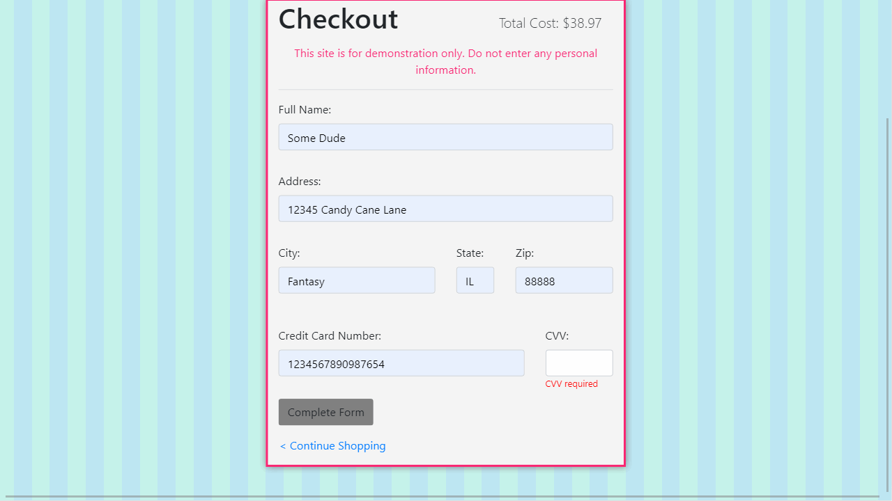

# Sheynanigans Bakery™

## Overview

Shenanigans Bakery™ is a full stack shopping cart app using React.js/Node.js

The app is live at [https://sheynanigans.marlonclay.com](https://sheynanigans.marlonclay.com)

- Content management system(CMS) using PostgreSQL as the database
- Front end coded using React and Bootstrap
- User can add and remove items form the cart
- User can "Purchase" items (No processing is done).

## Technologies Used

- React
- Node.js
- Express
- Express Session
- Webpack
- PostgreSQL
- Bootstrap 4
